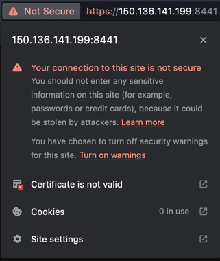
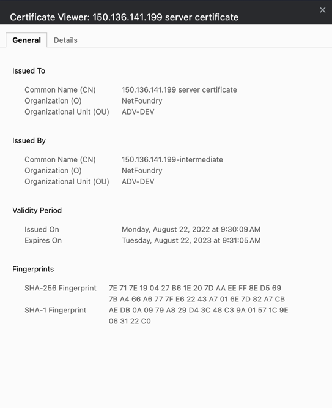

import CliLogin from '../../_cli-login.md'

The following are examples of how an invalid server cert will present itself on a running Ziti Network. There are certs 
for the edge API and the control plane so it's important to check for both as they will likely share the same expiry 
date.
## From Ziti Desktop Edge
### Controller Edge Certs
If connecting through an edge client, the identity will show as status `unavailable` and when looking into the ZDE logs 
you will see something similar to the following.
```
ERROR ziti-sdk:ziti_ctrl.c:155 ctrl_resp_cb() ctrl[150.136.141.199] request failed: -53(software caused connection abort)
DEBUG ziti-sdk:ziti_ctrl.c:777 ctrl_paging_req() ctrl[150.136.141.199] starting paging request GET[/services]
ERROR ziti-sdk:ziti_ctrl.c:155 ctrl_resp_cb() ctrl[150.136.141.199] request failed: -53(software caused connection abort)
ERROR ziti-sdk:ziti.c:1052 update_services() ztx[0] failed to get service updates err[CONTROLLER_UNAVAILABLE/software caused connection abort] from ctrl[https://150.136.141.199:8441]
```
### Control Plane Certs
The edge client will not provide any indication that the control plane certs are invalid.

## Ziti CLI Login
<CliLogin/>

### Controller Edge Certs
If logging into the controller's edge API you will see the following repeated result.
```
ERROR Get "https://150.136.141.199:8441/edge/client/v1/version": tls: failed to verify certificate: x509: certificate has expired or is not yet valid: current time 2023-09-20T13:33:20-04:00 is after 2023-08-22T13:31:05Z, Attempt 1
```
### Control Plane Certs
If you attempt to log into the control plane, you will see the following error.
```
error: unable to retrieve server certificate authority from https://localhost:6262: Get "https://localhost:6262/.well-known/est/cacerts": remote error: tls: bad certificate
```

## Via a Web Browser
If your controller's edge or control plane (unlikely) is publicly accessible, when you visit the url, the browser will 
give you an indication that your cert is invalid.



If we dig a little further and view the cert using the web browser's certificate viewer. We can see this cert is invalid
due to the validity period. The current date is past the `Expires On` field.



## Controller Logs
Finally, if we look at the controller logs we will see an error similar to the following.
### Control Plane Certs
Here is an example of errors relating to calls on the control plane (`6262`).
```
homeassistant2 ziti-controller[228919]: {"_context":"tls:0.0.0.0:6262","file":"github.com/openziti/channel@v0.18.58/classic_listener.go:158","func":"github.com/openziti/channel.(*classicListener).acceptConnection.func1","level":"error","msg":"error receiving hello from [tls:127.0.0.1:46742] (receive error (remote error: tls: bad certificate))","time":"2023-09-21T17:18:03.370Z"}
homeassistant2 ziti-controller[228919]: {"level":"info","msg":"http: TLS handshake error from 75.71.4.095:55762: EOF","time":"2023-09-21T17:18:03.893Z"}
homeassistant2 ziti-controller[228919]: {"level":"info","msg":"http: TLS handshake error from 75.71.4.095:50110: EOF","time":"2023-09-21T17:18:07.812Z"}
```
### Controller Edge Certs
And here, we see errors relating to calls on the edge API (`8441`). These aren't as clear as it doesn't tell us there 
was an attempt to reach port `8441` however, it's identifiable because it shows the originating IP `75.71.4.095` which 
is the public IP of the machine I used to attempt a login.
```
homeassistant2 ziti-controller[228919]: {"level":"info","msg":"http: TLS handshake error from 75.71.4.095:50752: remote error: tls: bad certificate","time":"2023-09-21T17:20:21.955Z"}
homeassistant2 ziti-controller[228919]: {"level":"info","msg":"http: TLS handshake error from 75.71.4.095:50768: remote error: tls: bad certificate","time":"2023-09-21T17:20:22.134Z"}
```

## Creating New Certs

### Create a New Server Cert for Control Plane

Setup environment, the following environment variables are the minimum required to renew a cert. These can be obtained 
through the `.env` file for your network. However, I recommend changing the `FILE_NAME_ROOT` so it creates a new cert 
rather than overwriting the existing cert.

```
export ZITI_PKI="/home/ubuntu/.ziti/quickstart/homeassistant2/pki"
export ZITI_CA_NAME="homeassistant2-intermediate"
export FILE_NAME_ROOT="homeassistant2-new"
export DNS_ALLOW_LIST="localhost,homeassistant2"
export IP_ALLOW_LIST="127.0.0.1,150.136.141.199"
```

Create server cert

```
source /dev/stdin <<< "$(wget -qO- https://get.openziti.io/quick/ziti-cli-functions.sh)"; expressInstall
ziti pki create server --pki-root="${ZITI_PKI}" --ca-name "${ZITI_CA_NAME}" \
      --server-file "${FILE_NAME_ROOT}-server" \
      --dns "${DNS_ALLOW_LIST}" --ip "${IP_ALLOW_LIST}" \
      --server-name "${FILE_NAME_ROOT} server certificate"
```

### Create New Client Cert for Control Plane

```
ziti pki create client --pki-root="${ZITI_PKI}" --ca-name "${ZITI_CA_NAME}" \
          --client-file "${FILE_NAME_ROOT}-client" \
          --key-file "${FILE_NAME_ROOT}-server" \
          --client-name "${FILE_NAME_ROOT}"
```

### Create New Server Cert for Edge HTTP API

Update environment for edge certs

```
export ZITI_CA_NAME="150.136.141.199-intermediate"
export FILE_NAME_ROOT="150.136.141.199-new"
```

Create server cert

```
ziti pki create server --pki-root="${ZITI_PKI}" --ca-name "${ZITI_CA_NAME}" \
      --server-file "${FILE_NAME_ROOT}-server" \
      --dns "${DNS_ALLOW_LIST}" --ip "${IP_ALLOW_LIST}" \
      --server-name "${FILE_NAME_ROOT} server certificate"
```

### Create New Client Cert for Edge HTTP API

```
ziti pki create client --pki-root="${ZITI_PKI}" --ca-name "${ZITI_CA_NAME}" \
          --client-file "${FILE_NAME_ROOT}-client" \
          --key-file "${FILE_NAME_ROOT}-server" \
          --client-name "${FILE_NAME_ROOT}"
```

### Update Controller Config

If the original files were overwritten, no change is needed. However, if new files were generated along side existing files, the controller config `identity` and `web-->identity` sections need the `cert`, `server_cert`, and `key` fields updated to point to the new client, server certs and key.

Now, restart your controller and double check to ensure the certificates are now valid.