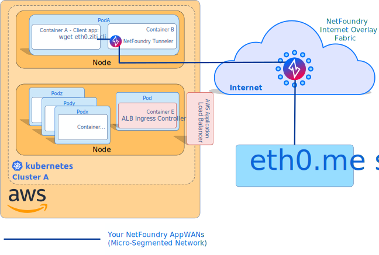

# Kubernetes Sidecar Proxy

## Overview

This guide shows you how to access a Ziti service with a non-Ziti client application that's running
in a Kubernetes pod. To provide access to the service, we will deploy the `ziti-tunnel` container as a sidecar in a pod with a demo client app.

This guide also demonstrates `ziti-tunnel`'s internal DNS server, which allows us to access Ziti services
by hostname instead of IP address.



[Here's some detail on how the various intercept modes work on Linux](/docs/reference/tunnelers/linux)

## Prerequisites

- Complete the [Minikube Quickstart](/docs/learn/quickstarts/network/local-kubernetes). This guide
  uses the Ziti Controller and Ziti Edge Router that are created in the Minikube Quickstart.
- Admin-level access to a Kubernetes cluster via `kubectl`.

## Create and Enroll an Identity

This guide will re-use the Ziti service "testapi-service", a REST API demo server, that was created in the quickstart.

1. We will create a new identity for our client app with the correct role to grant access to the Ziti service.

  ```text
  ziti edge create identity device sidecar-client \
    --jwt-output-file /tmp/sidecar-client.jwt --role-attributes testapi-clients
  ```

1. Enroll the identity.

  ```text
  ziti edge enroll /tmp/sidecar-client.jwt
  ```

## Restore the Quickstart KUBECONFIG If Necessary

You can restore the KUBECONFIG context from the Minikube quickstart like this if you switched contexts after running it.

```text
minikube --profile miniziti update-context
```

## Save the Identity in a Kubernetes Secret

The `ziti-tunnel` sidecar will access its identity by mounting a Kubernetes secret in the container.

```text
kubectl create secret generic "sidecar-client-identity" \
    --from-file=/tmp/sidecar-client.json
```

## Deploy the Pod

Deploy a Pod that runs a non-Ziti demo client application and `ziti-tunnel` as a sidecar proxy. For this
demonstration, the client application is `wget`. Our Pod sends a `POST` request to the demo testapi server in a loop so we can see the response in the log.

1. Find the CoreDNS cluster service IP address.

    You need to update the deployment manifest with the CoreDNS CLUSTER-IP address before you deploy. This is because the `ziti-tunnel` sidecar provides an override nameserver for the pod, so we need to inject the CoreDNS nameserver as fallback resolver for non-Ziti names because `ziti-tunnel` itself will not answer queries for non-Ziti DNS names.

    ```text
    kubectl --namespace kube-system get services kube-dns
    ```

1. Save the following to a file named /tmp/sidecar-demo.yaml.

    ```text
    # /tmp/sidecar-demo.yaml
    apiVersion: apps/v1
    kind: Deployment
    metadata:
      name: ziti-tunnel-sidecar-demo
    spec:
      replicas: 1
      selector:
        matchLabels:
          app: ziti-tunnel-sidecar-demo
      strategy:
        type: Recreate
      template:
        metadata:
          labels:
            app: ziti-tunnel-sidecar-demo
        spec:
          containers:
            - image: stedolan/jq
              name: testclient
              command: 
                - sh
                - -c
                - |
                  while true; do
                    set -x
                    wget --quiet \
                      --output-document=- \
                      --post-data ziti=awesome \
                      http://testapi.ziti/post \
                    | jq .data
                    set +x
                    sleep 3
                  done
            - image: openziti/ziti-tunnel
              name: ziti-tunnel
              args: ["tproxy"]
              env:
              - name: ZITI_IDENTITY_BASENAME
                value: sidecar-client  # the filename in the volume is sidecar-client.json
              volumeMounts:
              - name: sidecar-client-identity
                mountPath: /netfoundry
                readOnly: true
              securityContext:
                capabilities:
                  add:
                  - NET_ADMIN
          dnsPolicy: None
          dnsConfig:
            nameservers:
              - 127.0.0.1   # used by Ziti tunnel during startup to verify own DNS for the pod
              - 10.96.0.10  # change to CoreDNS cluster service address
          restartPolicy: Always
          volumes:
          - name: sidecar-client-identity
            secret:
              secretName: sidecar-client-identity
    ```

    You'll notice that the `ziti-tunnel` sidecar container has a few requirements:

    1. The basename (sans suffix) of the identity that is assumed by `ziti-tunnel` must be passed into the container with the
      `ZITI_IDENTITY_BASENAME` environment variable.
    2. The secret that we created above for the enrolled identity must be mounted into the container at
      "/netfoundry".

1. Once the manifest YAML is saved, we can deploy the pod with `kubectl`

    ```text
    kubectl apply -f /tmp/sidecar-demo.yaml
    ```

## Check the Logs

1. Find the name of the pod that Kubernetes deployed for us.

    ```text
    $ kubectl get pods
    ziti-tunnel-sidecar-demo-749c476989-6wpfn   1/1     Running   0          42s
    ```

1. Tail the logs for the "testclient" container inside the pod. The first few attempts didn't get a reply because the tunnel was starting up.

    ```text
    $ kubectl logs --follow ziti-tunnel-sidecar-demo-749c476989-6wpfn --container testclient
    + wget --quiet --output-document=- --post-data ziti=awesome http://testapi.ziti/post
    + jq .data
    + set +x
    + wget --quiet --output-document=- --post-data ziti=awesome http://testapi.ziti/post
    + jq .data
    + set +x
    + wget --quiet --output-document=- --post-data ziti=awesome http://testapi.ziti/post
    + jq .data
    "ziti=awesome"
    + set +x
    + wget --quiet --output-document=- --post-data ziti=awesome http://testapi.ziti/post
    + jq .data
    "ziti=awesome"
    + set +x
    + wget --quiet --output-document=- --post-data ziti=awesome http://testapi.ziti/post
    + jq .data
    "ziti=awesome"

Notice that the `wget` client is using the DNS name that we provided in the Ziti service definition to make the request.
