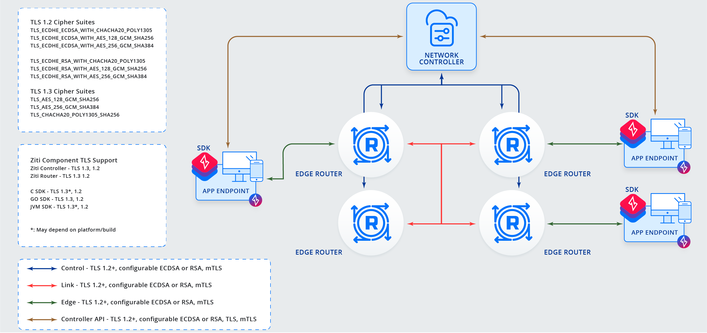
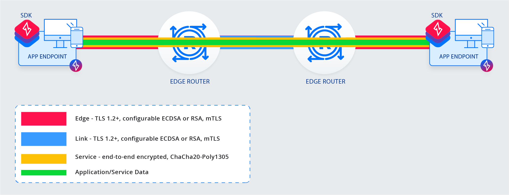

# Connection Security

Ziti networks use robust modern cryptography and security mechanisms. Each component within a Ziti network uses
security technology that fits its role and use-cases.

Here are the different types of connections:

- `control` -  connections between a controller and a router that manage network state. Secured via mTLS 1.2+
- `link` - connections between routers to form a mesh network. Secured via mTLS 1.2+
- `edge` - multiplexed connections between an SDK and an edge router that carries `service` connections. Secured via mTLS 1.2+
- `controller APIs` - connections between a controller and an SDK (or other software) via HTTPS and/or secure websockets. Secured via TLS, mTLS 1.2+
- `service` - connections carried by an `edge` connection and establish communication between a client and host. Application data is end-to-end encrypted via libsodium public private key cryptography.

Below is a diagram showing the `control`, `link`, `edge`, and `controller API` connections. The `service` connections
exist within an `edge` connection and are pictured in more detail in the second diagram.

Connections between SDKs and Edge Routers are called `edge` connections. `edge` connections are multiplexed and carry
multiple `service` connections. Each connection is for a specific service and secured with end-to-end encryption in 
order to transport application/service data securely between the two intended parties only.

## Control and Link Connection Details

Routers work in concert with a controller to establish a mesh network of `link` connections between routers. Routers coordinate
with a controller over a `control` connection. These connections are initialized and maintained while the network is in
operation. `control` and `link` connections are always authenticated using mTLS. The certificates that enable mTLS
for `control` connections are exchanged during router enrollment. The `control` connection between controllers and
Edge Routers is used to continuously update routers with the proper certificate information for all other routers in
the mesh.

## Controller API Connection Details

Controller APIs provide ways for clients (SDKs or otherwise) to interact with a network. The [edge management API](/reference/developer/api/02-edge-management-reference.mdx)
is used for configuration and maintenance. The [edge client API](/reference/developer/api/01-edge-client-reference.mdx)
is used to allow clients to authenticate, discover services, request [Sessions](sessions.md#session),
discover Edge Routers, and to perform basic self-maintenance.

Access to the APIs requires [authentication](authentication/auth.md) which results in an [API Session](authentication/auth.md#api-sessions)
being returned to the client. An [API Session](authentication/auth.md#api-sessions) is required to make `edge` connections.

## Edge Connection Details

`edge` connections are made between SDKs and Edge Routers. They require the following:

- a valid [API Session](authentication/auth.md#api-sessions) represented by a token
- a valid x509 certificate associated with the supplied [API Session](authentication/auth.md#api-sessions)
- a target Edge Router

An [API Session](authentication/auth.md#api-sessions) is obtained during authentication with either the edge client 
or management APIs. It is represented as a token. The x509 certificate used to establish the mTLS connection may 
either be the certificate used during authentication (if used) or an [API Session Certificate](authentication/20-api-session-certificates.md).

`edge` connections once establish allow the use of [Session](sessions.md#session) tokens to establish
`service` connections. When a [Session](sessions.md#session) is created, a list of valid Edge Router
is included in the response.

## Service Connection Details

`service` connections represent an SDK that has connected to a service (dial) or is hosting a service (bind). To
establish a `service` connection of either type the following is required:

- an `edge` connection to an edge router that has the correct policies in place to support the target service and intent (dial/bind)
- a [Session](sessions.md#session) for the target service and intent (dial/bind)

[Sessions](sessions.md#session) are issued by the controller's edge client API. A valid [Sessions](sessions.md#session) token 
must be included with dial and bind requests. Edge Routers validate API Session tokens continuously. If valid, the Edge 
Router will facilitate the connecting the client to a service or registering the client as a host.

Should a [Session](sessions.md#session) become invalid at any point, any existing `service` connection that 
was established using the invalidated Session will be terminated. Attempts to re-establish connection with the 
invalidated [Session](sessions.md#session) will be refused.
