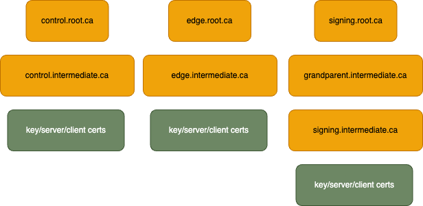

The following explains the steps that happen automatically when the expressInstall function is executed.
The [Local - No Docker](../local-no-docker.md), [Local - With Docker](../local-with-docker.md), 
[Local - Docker Compose](../local-docker-compose.md), and [Host OpenZiti Anywhere](../hosted.md) quickstarts all run 
the `expressInstall` function. Each version varies slightly. This page will focus on the 
[Local - No Docker](../local-no-docker.md) quickstart.

## The General Process

1. Obtain the OpenZiti binary
2. Create a PKI
3. Create a Controller configuration
4. Initialize the Controller
5. Start the Controller
6. Create a Router configuration
7. Create a Router entity on the network (via the Controller)
8. Enroll the Router previously created
9. Add default edge router and Service edge router policies.

## General Environment Setup

### Obtain the OpenZiti Binary

The `expressInstall` function will call `getZiti` to obtain the Ziti binary. The `getZiti` function detects your
OS type and architecture to craft the specific download URL for the binary. The binary is downloaded, and extracted to
a directory within the network directory.
:::note
The quickstart script isn't limited to `expressInstall`. You can source the `ziti-cli-function.sh` file and run any of
the many helpful functions. For example, you can run `getZiti` to get the latest version of OpenZiti downloaded quickly
and easily.
:::

### Create a PKI

As part of the `expressInstall` a PKI is generated automatically. The PKI consists of a root CA, four intermediate
CAs; one for each of the controller's config sections (control, edge/API, identity) and an arbitrary CA. Additionally,
an extra intermediate CA is created on the signing cert chain to demonstrate that arbitrary cert chain lengths
are acceptable.

Once the CAs are generated, a key, server cert, and client cert are generated for each of the controller's config
sections. The following image represents the overall PKI architecture.



### Update the CA Bundle

The latest tunnelers require full and complete PKIs, not arbitrary trust anchors. Therefore, the root and intermediate
CAs must be added to the CA bundle. Additionally, the file is copied for the Edge/API CA bundle.

```
cat "${ZITI_PKI}/my.root.ca/certs/my.root.ca.cert" > "${ZITI_PKI}/${ZITI_NETWORK}-network-components/cas.pem"
cat "${ZITI_PKI}/my.root.ca/certs/intermediate.from.external.ca.cert" >> "${ZITI_PKI}/${ZITI_NETWORK}-network-components/cas.pem"
cp "${ZITI_PKI}/${ZITI_NETWORK}-network-components/cas.pem" "${ZITI_PKI}/${ZITI_NETWORK}-edge/edge.cas.pem"
```

### Controller Creation and Configuration

A controller configuration file is generated using the OpenZiti CLI binary. After the configuration is created, the
controller is initialized. The process of initialization also initializes the database.

The controller is then started and the quickstart waits for the controller to finish starting up before continuing as
the controller is necessary to create the edge router which happens in the next steps.

### Default Policies

Two policies are generated to simplify the process of getting started with the network.
An [Edge Router Policy](../../../core-concepts/security/authorization/policies/overview#edge-router-policies)
is created to allow all identities to connect to a router with a `#public` attribute. The router created during the
`expressInstall` is populated with this attribute.
A [Service edge router policy](../../../core-concepts/security/authorization/policies/overview#service-edge-router-policies)
is also created, allowing all services to use routers with the `#public` attribute.

### Router Creating and Configuration

Just as with the controller, a config file is generated for the router. The router also needs to be created through the
controller. This will generate a one-time token (OTT) to be used during router enrollment.

The router is then enrolled using the router configuration along with the router's OTT.

## Customization

The quickstart offers numerous environment variables for use in customizing your unique situation. Here is a list of
the most commonly used environment variables and their descriptions.

By default, the quickstart PKI is set up with `127.0.0.1` as the default IP. The `*_IP_OVERRIDE` variables allow you
to add an IP the PKI will be valid for.

- `ZITI_CTRL_EDGE_IP_OVERRIDE` an additional IP for the controller. This value is added to the PKI SANs IP
  field for
  the controller's edge PKI trust chain.
- `ZITI_ROUTER_IP_OVERRIDE` is a custom IP for the router.

Here are a few more common variables.

- `ZITI_CTRL_EDGE_ADVERTISED_ADDRESS` is the valid name for the Controller address used in the PKI.
- `ZITI_ROUTER_ADVERTISED_ADDRESS` is the advertised address of the router. This defaults to the value in
  `EXTERNAL_DNS` if set. Otherwise, the value in `EXTERNAL_IP` is used.
- `ZITI_CTRL_ADVERTISED_PORT` is the port used for the Controller's control plane address.
- `ZITI_CTRL_EDGE_ADVERTISED_PORT` is the port used for the Controller's Edge/API plane address.
- `ZITI_ROUTER_PORT` is the port used for the Router's advertised address.

The following are PKI related customization variables
:::caution PKI Generation Only Happens Once
It is extremely important that quickstart has the relevant information to set up your PKI. This generation is only
performed once so, if it is incorrect, the entire PKI needs to be regenerated.
:::
:::caution DNS is Preferred Over IP
It is highly recommended to use DNS over IP as this is a one time setup, if your IP changes, then your PKI is rendered
useless.
:::

```
export EXTERNAL_DNS="acme.example.com"
export EXTERNAL_IP="$(curl -s eth0.me)"
export ZITI_CTRL_EDGE_IP_OVERRIDE="${EXTERNAL_IP}"
export ZITI_ROUTER_IP_OVERRIDE="${EXTERNAL_IP}"
export ZITI_CTRL_EDGE_ADVERTISED_ADDRESS="${EXTERNAL_DNS:-${EXTERNAL_IP}}"
export ZITI_ROUTER_ADVERTISED_ADDRESS="${EXTERNAL_DNS:-${EXTERNAL_IP}}"
export ZITI_CTRL_ADVERTISED_PORT=8440
export ZITI_CTRL_EDGE_ADVERTISED_PORT=8441
export ZITI_ROUTER_PORT=8442
```
