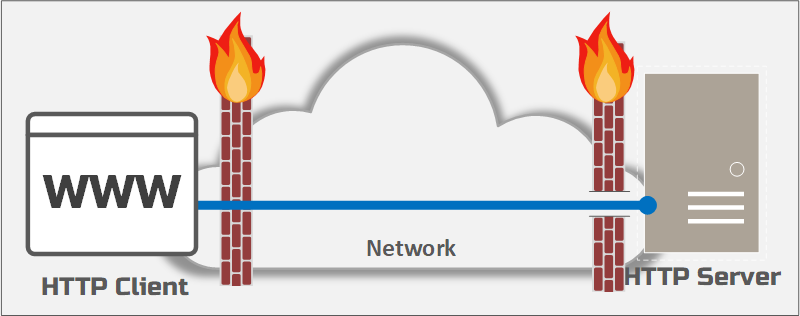
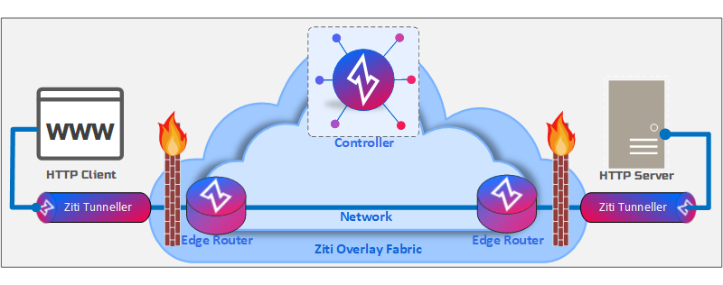

# Your First Service - Zero Trust Host Access

This document will demonstrate how to successfully deploy and secure an existing, "brown field" application using OpenZiti. You want to 
secure an application where you don't control the source or where you don't want to (or cannot) integrate an OpenZiti SDK into the 
application. These sorts of services are often web-based, so we'll focus here at exposing a web server. It's important to keep in mind 
that OpenZiti is a holistic zero trust networking solution. You can absolutely expose applications that are not web-based. For now, we'll start with a web server since that's a common need. 

---

## Solution Overview

Before we get into using OpenZiti, let's take a moment and review what the solution is like before we apply any zero trust networking 
principles. We will use some sort of http client, connect it over a network. The exact network does not matter. OpenZiti is applicable 
to any network be it host network, local network, the internet, private network, etc. 

### Simple HTTP Solution Overview - Before Ziti<br/>


The important aspect of this diagram is to notice that the HTTP server is provisioned on the [underlay](/reference/glossary.md#underlay)
network and requires a hole through the firewall to allow clients to connect.

### Simple HTTP Solution - After Ziti


After OpenZiti, we can see that there is no longer an open firewall to allow access to the HTTP server. Instead, the HTTP client 
will have its network requests intercepted by an OpenZiti tunneler. Once intercepted, the packets are then delivered to the OpenZiti
[overlay](/reference/glossary.md#network-overlay-overlay) fabric which has the responsibility to deliver the intercepted packets to the
target identity. Once delivered to the target identity, in this example, the traffic will offload back to the underlay network to be 
sent to the final destination: the HTTP Server.

With an understanding of what we are looking to accomplish in this guide, let's get into it!

---

## Implementing the Service

### Prerequisite - OpenZiti
You will need an OpenZiti overlay network in place before you can complete this guide. If you do not have an
OpenZiti overlay network provisioned yet, [follow a quickstart](/learn/quickstarts/quickstarts.md) and get a network up and running.

### Prerequisite - HTTP Server
You'll need an HTTP server which you plan to connect your HTTP client to. There are numerous ways to 
bring an HTTP server online but for this guide I have chosen to use docker and deploy a very simple HTTP application. The server will 
simply print out the "docker whale" when it's connected to. (This guide will not teach you how to install docker, nor how to install an 
HTTP server which is listening)  If you are familiar with docker and wish to use the exact same example as shown here, simply run the 
container with: `docker run -d --rm --name web-test -p 80:8000 openziti/hello-world`. 

If you have used the [Local - Docker Compose](/learn/quickstarts/network/local-docker-compose.md) quickstart 
to provision your OpenZiti overlay network, you will have already this HTTP server available to use immediately. 

### Prerequisite - HTTP Client Tunneler
You will need to install an [OpenZiti tunneler](/reference/tunnelers/index.mdx) on the machine which represents the HTTP client. Later on 
we'll create an identity for this tunneler and use the identity to access the HTTP server. 

### Prerequisite - HTTP Server Tunneler
You will need to install an [OpenZiti tunneler](/reference/tunnelers/index.mdx) on the machine which represents the HTTP server. Later on
we'll create an identity for this tunneler and use the identity to access the HTTP server. 

:::note
If you used the docker-compose quickstart the "private" edge routers are configured as tunnelers and will not require you to deploy 
another tunneler nor will you need to create another identity.
:::
> 
### Prerequisite - CLI
If you plan to use the `ziti` CLI tool, you will need to download and get the `ziti` executable on your path. If you have 
followed the [Local - No Docker](/learn/quickstarts/network/local-no-docker.md) quickstart, this will have been done for you and the executable will be located in `~/.ziti/quickstart/$(hostname -s)/ziti-bin/`.
Also, the .env file the quickstart emits can be used to put this folder on your path by simply sourcing that file. For example, if you
followed either the [Local - No Docker](/learn/quickstarts/network/local-no-docker.md) or 
[Host Ziti Anywhere](/learn/quickstarts/network/hosted.md) quickstart, you should have a file that can be sourced. Here is an example of 
my personal "Local - No Docker" result when sourcing that file:

```textell
$ source ~/.ziti/quickstart/$(hostname -s)/$(hostname -s).env

adding /home/cd/.ziti/quickstart/sg3/ziti-bin/ziti-v0.25.6 to the path
```

If you are using a docker-based example you can exec into the controller where the `ziti` CLI tool will be available and 
the env file which adds `ziti` to your path will be sourced for you as well. 

Here's an example command using `docker` to exec into the controller container:

```textell
$ docker exec -it docker_ziti-controller_1 bash

adding /var/openziti/ziti-bin to the path
```

---

### Configuring the Overlay - Overview

With our overlay network ready and with two tunneling applications deployed and ready to be used, we can start to configure our solution.

Here is an overview of the steps we will follow:
1. Create an identity for the HTTP client and assign an attribute "http-clients". We'll use this attribute when authorizing the clients to
   access the HTTP service
2. Create an identity for the HTTP server if you are not using an edge-router with the tunneling option enabled (see below). Also note 
   that if you are using the docker-compose quickstart or just plan to use an edge-router with tunneling enabled you can also skip this 
   step.
3. Create an [intercept.v1 config](/learn/core-concepts/config-store/overview.md). This config is used to instruct the client-side tunneler how 
   to correctly intercept the targeted traffic and put it onto the overlay.
4. Create a [host.v1 config](/learn/core-concepts/config-store/overview.md). This config is used instruct the server-side tunneler how to offload the 
   traffic from the overlay, back to the underlay.
5. Create a service to associate the two configs created previously into a service.
6. Create a service-policy to authorize "HTTP Clients" to "dial" the service representing the HTTP server.
7. Create a service-policy to authorize the "HTTP Server" to "bind" the service representing the HTTP server.
8. Start the server-side tunneler (unless using the docker-compose quickstart) with the HTTP server identity, providing access to the 
   HTTP server.
9. Start the client-side tunneler using the HTTP client identity.
10. Access the HTTP server securely over the OpenZiti zero trust overlay

We can do all these steps using the OpenZiti CLI tool: `ziti`. We can also accomplish this using the OpenZiti Admin Console. We'll 
demonstrate doing it both ways now.

### Configuring the Overlay Using Ziti CLI

Here you can find the steps necessary to configure your overlay network. You can copy/paste and run them all at once, or you can go 
slowly and run one command at a time to see how each command works. These commands are all based on a shell similar to bash. If you are 
not using bash you'll need to adapt these scripts to your shell.

#### HTTP Server IP/DNS
Note that step 4 below requires you to have set the variable named `http_server`. This variable represents the location of the HTTP 
server relative to the OpenZiti tunneler you're using. Look at the diagram above. You will want to supply the IP/FQDN of the server 
which runs the HTTP server that is relative to the tunneler. As an example, if you were to use the docker-compose quickstart and are 
going to reference the pre-deployed HTTP server that comes with it, you'd set `http_server` to `web-test-blue` since that is a valid 
name of the container running the HTTP server.

#### HTTP Server Identity
Note that step 7 below requires you to have set the variable named `http_server_id`. All of the quickstarts provision an edge-router 
with the tunneler option (`-t`) enabled. This means that edge-router is configured to serve as a tunneler. Run `ziti edge list 
identities` to find the name of the identity associated to the router.

```textell
# login to your controller - replace the host/port with the correct value
ziti edge login localhost:1280

# optional login: 
# if you're using docker and have exec'ed into your controller using docker you should be able to run the alias `zitiLogin` to login
# optional login:
# if you've sourced the .env file from a quickstart you should be able to run the alias `zitiLogin` to login

# 1. Create an identity for the HTTP client and assign an attribute "http-clients". We'll use this attribute when authorizing the clients to
#  access the HTTP service
ziti edge create identity user http-client -a 'http-clients' -o http.client.jwt 

#2. Create an identity for the HTTP server if you are not using an edge-router with the tunneling option enabled
ziti edge create identity user http-server -o http.server.jwt

#3. Create an intercept.v1 config. This config is used to instruct the client-side tunneler how to correctly intercept 
#   the targeted traffic and put it onto the overlay.
ziti edge create config http.intercept.v1 intercept.v1 '{"protocols":["tcp"],"addresses":["http.ziti"], "portRanges":[{"low":80, "high":80}]}'
    
#4. Create a host.v1 config. This config is used instruct the server-side tunneler how to offload the traffic from 
#   the overlay, back to the underlay. 
ziti edge create config http.host.v1 host.v1 '{"protocol":"tcp", "address":"'"${http_server}"'", "port":80}'
    
#5. Create a service to associate the two configs created previously into a service.
ziti edge create service http.svc --configs http.intercept.v1,http.host.v1

#6. Create a service-policy to authorize "HTTP Clients" to "dial" the service representing the HTTP server.
ziti edge create service-policy http.policy.dial Dial --service-roles "@http.svc" --identity-roles '#http-clients'

#7. Create a service-policy to authorize the "HTTP Server" to "bind" the service representing the HTTP server.
ziti edge create service-policy http.policy.bind Bind --service-roles '@http.svc' --identity-roles "@${http_server_id}"

#8. Start the server-side tunneler (unless using the docker-compose quickstart) with the HTTP server identity.
#   [optional] if you don't use an edge-router as your tunneler, you will need to download and run the tunneler for your OS
#   if you are using a ziti-router, skip to step 9 below
# 
#   This step is dependant on platform. For this demo we'll be using a virtual machine running linux and we'll be using the
#   ziti-edge-tunnel binary. Copy the http.server.jwt from step 2 to the server machine. For the example we'll use /tmp/http.server.jwt
#
# enroll the server identity using ziti-edge-tunnel
./ziti-edge-tunnel enroll --jwt /tmp/http.server.jwt --identity /tmp/http.server.json
# run ziti-edge-tunnel for the client
sudo ./ziti-edge-tunnel run -i /tmp/http.server.json

#9. Start the client-side tunneler using the HTTP client identity.
#   This step is dependant on platform. For this demo we'll be using a virtual machine running linux and we'll be using the
#   ziti-edge-tunnel binary. Copy the http.client.jwt from step 1 to the client machine. For the example we'll use /tmp/http.client.jwt
#
# enroll the client identity using ziti-edge-tunnel
./ziti-edge-tunnel enroll --jwt /tmp/http.client.jwt --identity /tmp/http.client.json
# run ziti-edge-tunnel for the client
sudo ./ziti-edge-tunnel run -i /tmp/http.client.json

#10. Access the HTTP server securely over the OpenZiti zero trust overlay
curl http.ziti
<pre>
Hello World


                        ::::::::::::::::::::::::::::::::::::::::::::::::::::::::::::
                        :::::::::::::::::::,::$77777777777777,:,::::::::::::::::::::
                        ::::::::::::::::::77777777777777777777777~,:::::::::::::::::
                        :::::::::::::::77777777777777II7777777777777,:::::::::::::::
                        ::::::::::::$777777777777777I.:7777777777777777,::::::::::::
                        ::::::::::77777777777777777I...I7777777777777777I:::::::::::
                        :::::::::77777777777777777I....?777777777777777777::::::::::
                        :::::::$77777777777777777I......77777777777777777777::::::::
                        ::::::777777777777777777I.......I77777777777777777777,::::::
                        :::::777777777777777777I....?...?777777777777777777777::::::
                        :::,777777777777777777I....I7?...777777777777777777777$:::::
                        :::777777777777777777I....I77I...I777777777777777777777$::::
                        :::77777777777777777I....I7777...?7777777777777777777777::::
                        ::77777777777777777I....I77777?..,77777777777777777777777:::
                        ::7777777777777777I....I777777I...I77777777777777$7$$$$7$,::
                        :$777777777777777I....I77777777...?7777777777777$$77777777::
                        :777777777777777I ...I777II7777?...I.I7777777$777777777777::
                        :77777777777777I....I777I..7777I.......?I777$$$$$77$$$$7$$::
                        :7777777777777I....?I77I...I7777..........I777777$$$$$7$$$,:
                        :77777777777777?..  .??.   ?7777?  ..??.   .?7$7$$$7$$$$$7::
                        ,7777777777777777I..........I$77I...I777?....77777$7$$$$$$,,
                        :7777777777777777777?.......I7$$7..I777I....7$$$$$$$$$$$$$::
                        :777777777777777777777I.I=..?77777777$7....77$$$$$$$$7$$$$::
                        :777777777777777777777777I...I$7777777....77$$$$$$$$$$$$$$::
                        ::77777777777777$7$7$$$$$I...?7$$7$77....7$$$$$$$$$$$$$$$:::
                        ::777777777777777777$$$777+..~77$$7I....77$$$$$$$$$$$$$$$:::
                        :::77777777777777777777$$7I...7$$$I....7$7$$$$$$$$$$$$$$::::
                        :::Z77777777$7777777777$77I...?$77....I$$$$$$$$$$$$$$$$$::::
                        ::::77777$$$$$7777$$$$$$$$7:..+77....I$$$$$$$$$$$$$$$$$:::::
                        :::::77777$777$$$$777$$$$77I...I....I$$$$$$$$$$$$$$$$$::::::
                        ::::::$7777777$7777$$$7$$$$I...... I$$$$$$$$$$$$$$$$7:::::::
                        :::::::?$$$$$$$$$$$$$$$$$$$7=.....I$$$$$$$$$$$$$$$$=::::::::
                        :::::::::7$$$$$7$$$$$$$$$$$$?....77$$$$$$$$$$$$$$$::::::::::
                        ::::::::::,7$$7$$$$$$$$$$$$$7...I$$$$$$$$$$$$$$$::::::::::::
                        ::::::::::::~$$$$$$$$$$$$$$$7?.I$$$$$$$$$$$$$$::::::::::::::
                        :::::::::::::::$$$$$$$$$$$$$$77$$$$$$$$$$$$$::::::::::::::::
                        ::::::::::::::::::7$$$$$$$$$$$$$$$$$$$$$$:::::::::::::::::::
                        :::::::::::::::::::::::$$$$$$$$$$$$$::::::::::::::::::::::::
                        ::::::::::::::::::::::::::::::::::::::::::::::::::::::::::::


</pre>
```

### Ziti Admin Console (ZAC)

Optionally, you may [install the ZAC](/learn/quickstarts/zac/index.md) to manage your network with a UI.

### Testing Everything Works

Once you have set everything up As shown in the last step above - at this point you should be able to run a curl
statement or use a browser to access "http.ziti".
