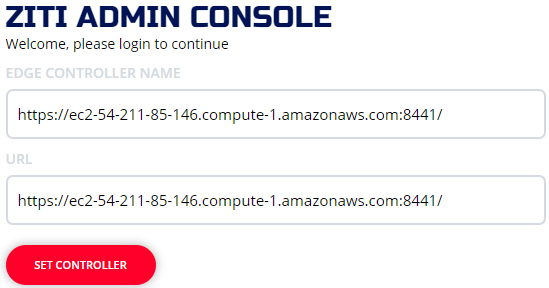

import Wizardly from '@site/src/components/Wizardly';

The Ziti Administration Console (ZAC) is a web UI provided by the OpenZiti project which will allow you to configure and
explore a [network](/learn/introduction/index.mdx).

## Overview

 These steps enable the console for a quickstart controller. Run these commands with a shell like `bash` in a Windows Subsystem for Linux (WSL), macOS, or Linux.

## Downloading From GitHub

These steps are applicable to both the [Local - No Docker](/learn/quickstarts/network/local-no-docker.md) and the
[hosted yourself](/learn/quickstarts/network/hosted.md) deployments.

1. On the controller host, download the latest release of the console from GitHub. You can use any console version >= 3.0.0.

    ```text
    wget https://github.com/openziti/ziti-console/releases/latest/download/ziti-console.zip
    ```

1. Ensure `ZITI_HOME` is set to your quickstart working directory and exported to forked processes. You can always restore the quickstart environment variables by sourcing the environment file.

   ```text
   source ${HOME}/.ziti/quickstart/$(hostname)/$(hostname).env
   export ZITI_HOME
   ```

1. Unzip the console in the controller's working directory.

    ```text
    unzip -d ${ZITI_HOME}/zac ./ziti-console.zip
    ```

1. In **${ZITI_HOME}/$(hostname -s).yaml**, add a web API binding `zac` in the list containing `edge-management`.

    ```text
          - binding: zac
            options:
              location: ./zac
              indexFile: index.html
    ```

1. Restart the controller service to apply the changes.

    ```text
    sudo systemctl restart ziti-controller.service
    ```

1. Navigate to the console in your web browser, e.g., `https://ctrl.ziti.example.com:1280/zac/`

## Using Docker

### Copy PKI From Controller

It's a good idea to use TLS everywhere. To do this, you'll need to provide ZAC a key and a certificate.
If you have used the [Local - With Docker](/learn/quickstarts/network/local-with-docker.md) quickstart to start
the network you can copy the certificates generated when the controller started.
Shown is an example which copies the certs from the OpenZiti container and uses them with ZAC. We'll copy the files
from the docker named volume `myPersistentZitiFiles` and put them into a folder at `$HOME/.ziti/zac-pki`.

```text
mkdir -p $HOME/.ziti/zac-pki

docker run -it --rm --name temp \
  -v myPersistentZitiFiles:/persistent \
  -v $HOME/.ziti/zac-pki:/zac-pki busybox \
  cp /persistent/pki/ziti-edge-controller-intermediate/keys/ziti-edge-controller-server.key /zac-pki
  
docker run -it --rm --name temp \
  -v myPersistentZitiFiles:/persistent \
  -v $HOME/.ziti/zac-pki:/zac-pki busybox \
  cp /persistent/pki/ziti-edge-controller-intermediate/certs/ziti-edge-controller-server.chain.pem /zac-pki
```

### Starting ZAC

With the certificates copied, you will be able to start the ZAC using one Docker command. Also notice the command
will expose the ZAC http and https ports to your local computer so that you can access the ZAC from outside of Docker.
If you customized any of these paths, you'll need to replace the paths specified accordingly (the '-v' lines).

 ```text
 docker run --rm \
        --name zac \
        -p 1408:1408 \
        -p 8443:8443 \
        -v "$HOME/.ziti/zac-pki/ziti-edge-controller-server.key":/usr/src/app/server.key \
        -v "$HOME/.ziti/zac-pki/ziti-edge-controller-server.chain.pem":/usr/src/app/server.chain.pem \
        openziti/zac
 ```

:::note
Do note that if you are exposing ports as shown above, you will need to ensure that `ziti-edge-controller` is
addressable by your machine in order to use Docker in this way. This guide does not go into how to do this in depth.
One easy, and common mechanism to do this would be to edit the 'hosts' file of your operating system. A quick
internet search should show you how to accomplish this.
:::

## Docker Compose

If you have followed the [Local - Docker Compose](/learn/quickstarts/network/local-docker-compose.md) quickstart you will have the ZAC
running already. It's now included with both the default docker-compose file and the simplified-docker-compose file.
Both compose files will start and expose the ZAC ports on 1408/8443.

:::note
Do note that if you are exposing ports as shown above, you will need to ensure that `ziti-edge-controller` is
addressable by your machine in order to use Docker in this way. This guide does not go into how to do this in depth.
One easy, and common mechanism to do this would be to edit the 'hosts' file of your operating system. A quick
internet search should show you how to accomplish this.
:::

## Kubernetes

[Kubernetes deployment guide](/docs/guides/deployments/30-kubernetes//kubernetes-console.mdx).

## Login and use ZAC

1. At this point you should be able to navigate to: `https://${ZITI_CTRL_EDGE_ADVERTISED_ADDRESS}:8443`and see the ZAC login
   screen. (The TLS warnings your browser will show you are normal - it's because these steps use a self-signed certificate
   generated during the installation process)

   :::note
   If you are using docker-compose to start your network, when you access ZAC for the first time you will need to
   specify the url of the controller. Since everything is running **in** docker compose this url is relative to the
   internal docker compose network that is declared in the compose file. You would enter
   `https://ziti-edge-controller:1280` as the controller's URL
   :::

2. Set the controller as shown (use the correct URL):

    1. Example using the "everything local" quickstart:
       

    2. Example using the "docker-compose" quickstart:
       

    3. Example using AWS "host it anywhere":
       

3. Optionally, [**change admin's password**](/learn/quickstarts/network/help/change-admin-password.md#ziti-console)

<Wizardly></Wizardly>
